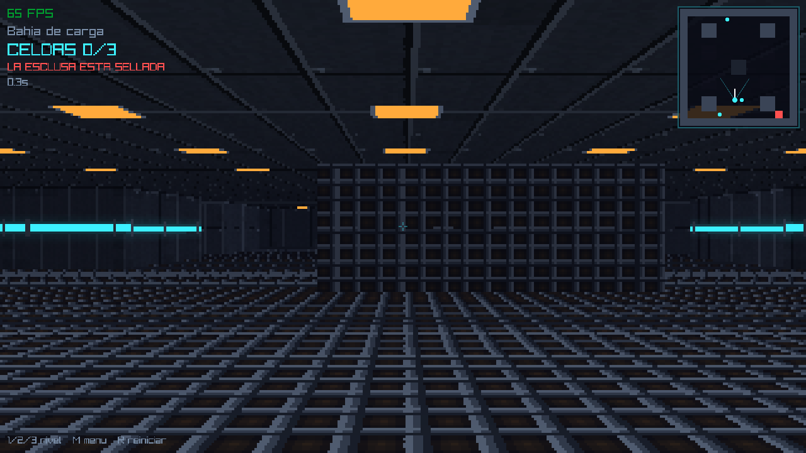
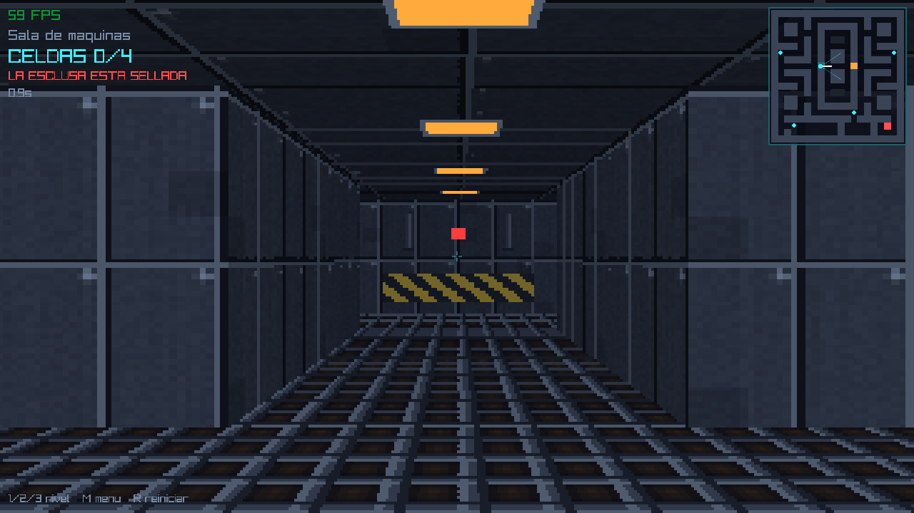
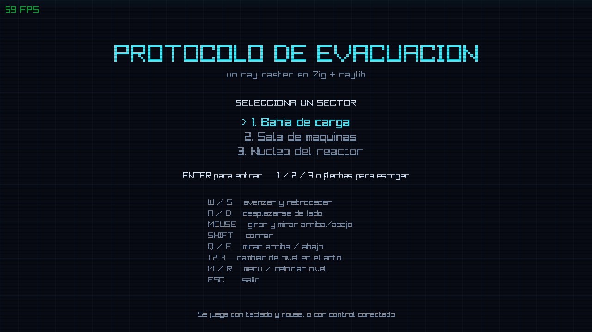

# Proyecto 1 - Zig: Ray Caster «Protocolo de Evacuación»

Un ray caster estilo Wolfenstein 3D escrito desde cero en
[Zig](https://ziglang.org/) 0.16 sobre [raylib](https://www.raylib.com/) (vía
[raylib-zig](https://github.com/raylib-zig/raylib-zig)). Recorres una nave
espacial abandonada recogiendo celdas de energía; cuando juntas todas, la
esclusa del sector se desbloquea y puedes salir.

Todo lo que se ve y se oye está generado por código: **no hay un solo archivo de
imagen ni de audio en el repositorio**. Las texturas de las paredes, los cuadros
de los sprites, los efectos de sonido y la música de ambiente se sintetizan al
arrancar.



## Requisitos

- [Zig](https://ziglang.org/) 0.16.0 o superior.
- Conexión a internet la primera vez, para que el gestor de paquetes baje
  raylib-zig. Después compila sin red.

## Cómo correr

```sh
zig build run
```

El proyecto compila en `ReleaseFast` por defecto, porque el renderizador escribe
el framebuffer completo en cada cuadro y en `Debug` va varias veces más lento.

```sh
zig build test
```

Corre las 35 pruebas unitarias. No abren ventana ni tocan la GPU: solo usan
tipos de raylib, nunca sus funciones, así que se ejecutan headless.

```sh
zig build run -Doptimize=Debug
```

Para depurar y para ver el reporte de fugas del `DebugAllocator` al salir.

## Estructura

- `src/main.zig` — constantes de resolución, montaje de la ventana y el audio,
  máquina de estados y bucle principal.
- `src/levels.zig` — los tres niveles como arte ASCII embebido, igual que los
  patrones de Conway del Lab 2.
- `src/world.zig` — `Tile`, `Sprite` y `World`: parseo del mapa, consulta de
  celdas, colisión contra el mapa, puertas, recolección y condición de victoria.
- `src/player.zig` — `Player` e `Input`: movimiento, resolución de colisión por
  eje, cabeceo y vista vertical.
- `src/raycaster.zig` — `Framebuffer`, el DDA, las paredes texturizadas, el piso
  y techo, y los sprites recortados contra el z-buffer.
- `src/textures.zig` — `Atlas`: todo el pixel art procedural.
- `src/audio.zig` — `Sfx`: síntesis de los efectos en memoria.
- `src/music.zig` — la música de ambiente, generada como un WAV completo en RAM.
- `src/hud.zig` — minimapa, HUD y las pantallas de bienvenida y de éxito.

## Controles

| Tecla | Acción |
|---|---|
| `W` / `S` | Avanzar y retroceder |
| `A` / `D` | Desplazarse de lado |
| Mouse | Girar y mirar arriba/abajo |
| Flechas ← → | Girar |
| `Q` / `E` | Mirar arriba / abajo |
| `Shift` | Correr |
| `1` `2` `3` | Cambiar de nivel en el acto |
| `M` | Volver al menú |
| `R` | Reiniciar el nivel |
| `N` | Siguiente sector (desde la pantalla de éxito) |
| `Esc` | Salir |

También se juega con control: stick izquierdo para moverse, stick derecho para
mirar, gatillo derecho para correr y `A` para confirmar. Si no hay mando
conectado no se lee nada, así que el juego funciona igual sin él.

## Niveles

| # | Sector | Tamaño | Celdas | Rasgos |
|---|---|---|---|---|
| 1 | Bahía de carga | 16×16 | 3 | Planta abierta con pilares y rejillas de ventilación |
| 2 | Sala de máquinas | 20×20 | 4 | Laberinto simétrico con dos compuertas hidráulicas |
| 3 | Núcleo del reactor | 24×24 | 5 | Cuatro anillos concéntricos con las aberturas rotadas |

En el Núcleo del reactor cada anillo tiene su hueco en un lado distinto, así que
hay que dar la vuelta completa a cada uno para llegar al centro.




Medido en un Apple M3: **1480 FPS** de promedio en `ReleaseFast` y **167 FPS** en
`Debug`, contra los 15 que pide la rúbrica. En el juego está limitado a 60 con
vsync para no calentar la máquina de gusto.

## Rúbrica cubierta

Desglose de los objetivos de la rúbrica que ya cumple esta entrega:

-  **15 pts** — FPS mostrados en pantalla (`rl.drawFPS`, esquina superior
  izquierda), muy por encima del mínimo de 15.
-  **20 pts** — Cámara con avance/retroceso y rotación (`player.zig`).
  -  **+10 pts** — Rotación horizontal con el mouse.
  -  **+5 pts** — Vista vertical (pitch con mouse o `Q`/`E`) y cabeceo al
    caminar/correr (`BOB_FREQ` / `BOB_AMP` en `player.zig`, más notorio al
    correr).
-  **10 pts** — Minimapa en la esquina superior derecha (`hud.zig`), separado
  del mapa principal.
-  **5 pts** — Música de fondo generada en `music.zig`.
-  **10 pts** — Efectos de sonido (`audio.zig`: paso, puerta, recolección,
  acceso denegado, victoria).
-  **20 pts** — Animación de sprites (celdas de energía y vapor, varios
  cuadros cada uno).
-  **5 pts** — Pantalla de bienvenida (`hud.zig`).
-  **10 pts** — Múltiples niveles, cambiables con `1`/`2`/`3` o con `N` al
  ganar (no por argumento de arranque ni recompilar).
-  **10 pts** — Pantalla de éxito al recolectar todas las celdas y abrir la
  esclusa.

**Subtotal confirmado: 115 pts** 

Pendiente:

- **0-30 pts** — Estética del nivel: criterio subjetivo, queda a evaluación
  del profesor.

## Por qué no se puede atravesar una pared

Es el requisito que más fácil se rompe, así que tiene tres defensas
independientes y cinco pruebas que las respaldan:

1. **Colisión por eje separado.** Si el avance en X choca se descarta solo X y se
   conserva Y, y al revés. Eso además hace que uno se deslice a lo largo de la
   pared en diagonal en vez de frenarse en seco.
2. **Tope del delta de tiempo y submuestreo.** Arrastrar la ventana o pausar en
   un breakpoint produce un cuadro de varios segundos; sin tope, el jugador
   saltaría decenas de celdas de un golpe. El paso se acota a 50 ms y además se
   parte en trozos menores a medio radio de colisión.
3. **Fuera del mapa es pared.** `World.at` devuelve panel sólido para cualquier
   coordenada fuera de rango. Eso encierra al jugador dentro del arreglo pase lo
   que pase, y de paso garantiza que el DDA siempre termine chocando contra algo.

La prueba más valiosa del proyecto es `"cada nivel esta cerrado por paredes en
todo su borde"`, que recorre los tres niveles verificando el perímetro completo:
mientras pase, ninguna de las tres defensas puede quedar sin respaldo.



## Créditos

Todo el contenido —texturas, sprites, efectos de sonido, música y niveles— es
original y está generado por el código de este repositorio. La única dependencia
externa es raylib.
